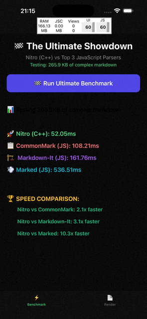

<p align="center">
  
  
</p>

# react-native-nitro-markdown

Native Markdown parsing and rendering for React Native.

`react-native-nitro-markdown` uses `md4c` (C++) through Nitro Modules (JSI) to parse Markdown synchronously into a typed AST, then render it with customizable React Native components.

## Why use it

- Native parser (`md4c`) for lower JS thread overhead on large documents
- End-to-end solution: parser + renderer + streaming session API
- Headless API for custom rendering and text processing
- GFM support (tables, strikethrough, task lists, autolinks)
- Optional math rendering with `react-native-mathjax-svg`

## Requirements

- React Native `>=0.75.0`
- `react-native-nitro-modules`

Optional for math rendering:

- `react-native-mathjax-svg >=0.9.0`
- `react-native-svg >=13.0.0`

## Installation

### React Native

```bash
bun add react-native-nitro-markdown react-native-nitro-modules
```

Optional math support:

```bash
bun add react-native-mathjax-svg react-native-svg
```

iOS pods:

```bash
cd ios && pod install
```

### Expo (development build)

```bash
bunx expo install react-native-nitro-markdown react-native-nitro-modules
bunx expo prebuild
```

Optional math support:

```bash
bunx expo install react-native-mathjax-svg react-native-svg
```

## Quick Start

```tsx
import { Markdown } from "react-native-nitro-markdown";

export function Example() {
  return (
    <Markdown options={{ gfm: true }}>
      {"# Hello\nThis is **native** markdown."}
    </Markdown>
  );
}
```

## Package Exports

### Main Entry (`react-native-nitro-markdown`)

- Parser and headless helpers:
  - `parseMarkdown`
  - `parseMarkdownWithOptions`
  - `getTextContent`
  - `getFlattenedText`
  - `MarkdownParserModule`
- Components:
  - `Markdown`
  - `MarkdownStream`
- Hooks and sessions:
  - `useMarkdownSession`
  - `useStream`
  - `createMarkdownSession`
- Context:
  - `MarkdownContext`
  - `useMarkdownContext`
- Theme:
  - `defaultMarkdownTheme`
  - `minimalMarkdownTheme`
  - `mergeThemes`
- Built-in renderers:
  - `Heading`, `Paragraph`, `Link`, `Blockquote`, `HorizontalRule`
  - `CodeBlock`, `InlineCode`
  - `List`, `ListItem`, `TaskListItem`
  - `TableRenderer`, `Image`, `MathInline`, `MathBlock`
- Types:
  - `MarkdownNode`, `ParserOptions`, `MarkdownParser`
  - `CustomRenderers`, `CustomRenderer`, `CustomRendererProps`
  - `NodeRendererProps`, `BaseCustomRendererProps`, `EnhancedRendererProps`
  - `HeadingRendererProps`, `LinkRendererProps`, `ImageRendererProps`
  - `CodeBlockRendererProps`, `InlineCodeRendererProps`
  - `ListRendererProps`, `TaskListItemRendererProps`
  - `LinkPressHandler`, `MarkdownContextValue`
  - `MarkdownTheme`, `PartialMarkdownTheme`, `NodeStyleOverrides`, `StylingStrategy`
  - `MarkdownSession`

### Headless Entry (`react-native-nitro-markdown/headless`)

Exports only parser-related API (`parseMarkdown`, `parseMarkdownWithOptions`, `getTextContent`, `getFlattenedText`, types). Use this when you do not need built-in UI rendering.

## Component API

## `Markdown`

```tsx
import { Markdown } from "react-native-nitro-markdown";
```

| Prop                  | Type                   | Default                                          | Description                                                                               |
| --------------------- | ---------------------- | ------------------------------------------------ | ----------------------------------------------------------------------------------------- | -------------------- |
| `children`            | `string`               | required                                         | Markdown input string.                                                                    |
| `options`             | `ParserOptions`        | `undefined`                                      | Parser flags (`gfm`, `math`).                                                             |
| `renderers`           | `CustomRenderers`      | `{}`                                             | Per-node custom renderers.                                                                |
| `theme`               | `PartialMarkdownTheme` | `defaultMarkdownTheme` or `minimalMarkdownTheme` | Theme token overrides.                                                                    |
| `styles`              | `NodeStyleOverrides`   | `undefined`                                      | Per-node style overrides.                                                                 |
| `stylingStrategy`     | `"opinionated"         | "minimal"`                                       | `"opinionated"`                                                                           | Base styling preset. |
| `style`               | `StyleProp<ViewStyle>` | `undefined`                                      | Container style for the root `View`.                                                      |
| `onParsingInProgress` | `() => void`           | `undefined`                                      | Called when parse inputs change.                                                          |
| `onParseComplete`     | `(result) => void`     | `undefined`                                      | Called with `{ raw, ast, text }` after successful parse.                                  |
| `onLinkPress`         | `LinkPressHandler`     | `undefined`                                      | Intercepts link press before default open behavior. Return `false` to block default open. |

Notes:

- Parse failures are caught and rendered as a fallback message (`Error parsing markdown`).
- `text` in `onParseComplete` is produced by `getFlattenedText(ast)`.

## `MarkdownStream`

```tsx
import { MarkdownStream } from "react-native-nitro-markdown";
```

`MarkdownStreamProps` extends `MarkdownProps` except `children`.

| Prop                   | Type              | Default  | Description                                        |
| ---------------------- | ----------------- | -------- | -------------------------------------------------- | --------------------------------------------------------- |
| `session`              | `MarkdownSession` | required | Session object that supplies streamed text chunks. |
| `updateIntervalMs`     | `number`          | `50`     | Flush interval when `updateStrategy="interval"`.   |
| `updateStrategy`       | `"interval"       | "raf"`   | `"interval"`                                       | Update cadence (`setTimeout` vs `requestAnimationFrame`). |
| `useTransitionUpdates` | `boolean`         | `false`  | Applies `startTransition` to streamed UI updates.  |

### Streaming Example

```tsx
import { useEffect } from "react";
import {
  MarkdownStream,
  useMarkdownSession,
} from "react-native-nitro-markdown";

export function StreamingExample() {
  const session = useMarkdownSession();

  useEffect(() => {
    const s = session.getSession();
    s.append("# Streaming\n");
    s.append("This text arrives in chunks.");

    return () => session.clear();
  }, [session]);

  return (
    <MarkdownStream
      session={session.getSession()}
      options={{ gfm: true }}
      updateStrategy="raf"
      useTransitionUpdates
    />
  );
}
```

## Hooks and Session API

## `createMarkdownSession()`

Creates and returns a native `MarkdownSession` instance.

```tsx
import { createMarkdownSession } from "react-native-nitro-markdown";

const session = createMarkdownSession();
session.append("hello");
```

## `useMarkdownSession()`

Creates and owns one `MarkdownSession` for a component lifecycle.

Returns:

| Field            | Type                         | Description                                                   |
| ---------------- | ---------------------------- | ------------------------------------------------------------- |
| `getSession`     | `() => MarkdownSession`      | Returns the stable native session instance.                   |
| `isStreaming`    | `boolean`                    | Stateful flag for app-level streaming UI.                     |
| `setIsStreaming` | `(value: boolean) => void`   | Setter for `isStreaming`.                                     |
| `stop`           | `() => void`                 | Sets `isStreaming` to `false`.                                |
| `clear`          | `() => void`                 | Clears session content and resets `highlightPosition` to `0`. |
| `setHighlight`   | `(position: number) => void` | Sets `session.highlightPosition`.                             |

## `useStream(timestamps?)`

Builds on `useMarkdownSession` and adds timeline sync helpers.

- `timestamps` type: `Record<number, number>` where key = word/token index, value = timestamp in ms.
- `sync(currentTimeMs)` computes highlight position from timestamp map.
- Uses optimized lookup for monotonic timelines and handles non-monotonic maps safely.

Additional returned fields:

| Field          | Type                              | Description                               |
| -------------- | --------------------------------- | ----------------------------------------- |
| `isPlaying`    | `boolean`                         | Playback state for timed streaming.       |
| `setIsPlaying` | `(value: boolean) => void`        | Setter for `isPlaying`.                   |
| `sync`         | `(currentTimeMs: number) => void` | Applies timeline-based highlight updates. |

## Headless API

```tsx
import {
  parseMarkdown,
  parseMarkdownWithOptions,
  getTextContent,
  getFlattenedText,
} from "react-native-nitro-markdown/headless";
```

| Function                   | Signature                                                | Description                                                        |
| -------------------------- | -------------------------------------------------------- | ------------------------------------------------------------------ |
| `parseMarkdown`            | `(text: string) => MarkdownNode`                         | Parses markdown using default parser settings.                     |
| `parseMarkdownWithOptions` | `(text: string, options: ParserOptions) => MarkdownNode` | Parses markdown with `gfm` and/or `math` flags.                    |
| `getTextContent`           | `(node: MarkdownNode) => string`                         | Concatenates text recursively without layout normalization.        |
| `getFlattenedText`         | `(node: MarkdownNode) => string`                         | Returns normalized plain text with paragraph and block separators. |

### Parser Options

```ts
type ParserOptions = {
  gfm?: boolean;
  math?: boolean;
};
```

## Custom Renderer API

## `renderers` prop contract

`CustomRenderers` is:

```ts
type CustomRenderers = Partial<Record<MarkdownNode["type"], CustomRenderer>>;
```

`CustomRenderer` receives `EnhancedRendererProps` and returns:

- React node to override default rendering
- `undefined` to fallback to built-in renderer
- `null` to render nothing

`EnhancedRendererProps` always includes:

- `node`: current `MarkdownNode`
- `children`: pre-rendered node children
- `Renderer`: recursive renderer component for nested custom rendering

And conditionally includes mapped fields by node type:

| Node type        | Extra mapped fields   |
| ---------------- | --------------------- |
| `heading`        | `level`               |
| `link`           | `href`, `title`       |
| `image`          | `url`, `alt`, `title` |
| `code_block`     | `content`, `language` |
| `code_inline`    | `content`             |
| `list`           | `ordered`, `start`    |
| `task_list_item` | `checked`             |

### Example: Custom heading + code block

```tsx
import {
  Markdown,
  type HeadingRendererProps,
  type CodeBlockRendererProps,
} from "react-native-nitro-markdown";

const renderers = {
  heading: ({ level, children }: HeadingRendererProps) => (
    <MyHeading level={level}>{children}</MyHeading>
  ),
  code_block: ({ language, content }: CodeBlockRendererProps) => (
    <MyCode language={language} content={content} />
  ),
};

<Markdown renderers={renderers}>{content}</Markdown>;
```

## Link Handling Behavior

Default link renderer behavior:

1. Trims incoming href.
2. Calls `onLinkPress(href)` if provided.
3. Stops if handler returns `false`.
4. Allows only protocol-based links with these schemes:
   - `http:`
   - `https:`
   - `mailto:`
   - `tel:`
   - `sms:`
5. Uses `Linking.canOpenURL` before `Linking.openURL`.

Relative URLs and anchors are ignored by default open behavior, but you can handle them in `onLinkPress`.

## Theme API

## `MarkdownTheme`

```tsx
import type {
  MarkdownTheme,
  PartialMarkdownTheme,
} from "react-native-nitro-markdown";
```

`MarkdownTheme` fields:

- `colors`
  - `text`, `textMuted`, `heading`, `link`, `code`, `codeBackground`, `codeLanguage`
  - `blockquote`, `border`, `surface`, `surfaceLight`, `accent`
  - `tableBorder`, `tableHeader`, `tableHeaderText`, `tableRowEven`, `tableRowOdd`
- `spacing`: `xs`, `s`, `m`, `l`, `xl`
- `fontSizes`: `xs`, `s`, `m`, `l`, `xl`, `h1`, `h2`, `h3`, `h4`, `h5`, `h6`
- `fontFamilies`: `regular`, `heading`, `mono`
- `headingWeight?`
- `borderRadius`: `s`, `m`, `l`
- `showCodeLanguage`

Helpers:

- `defaultMarkdownTheme`
- `minimalMarkdownTheme`
- `mergeThemes(base, partial)`

`NodeStyleOverrides` lets you override per-node styles:

```ts
type NodeStyleOverrides = Partial<
  Record<MarkdownNode["type"], ViewStyle | TextStyle>
>;
```

## Built-in Renderer Components

Use these when composing custom renderer maps.

| Component        | Key props                                        |
| ---------------- | ------------------------------------------------ |
| `Heading`        | `level`, `children`, `style`                     |
| `Paragraph`      | `children`, `inListItem`, `style`                |
| `Link`           | `href`, `children`, `style`                      |
| `Blockquote`     | `children`, `style`                              |
| `HorizontalRule` | `style`                                          |
| `CodeBlock`      | `language`, `content`, `node`, `style`           |
| `InlineCode`     | `content`, `node`, `children`, `style`           |
| `List`           | `ordered`, `start`, `depth`, `children`, `style` |
| `ListItem`       | `children`, `index`, `ordered`, `start`, `style` |
| `TaskListItem`   | `children`, `checked`, `style`                   |
| `TableRenderer`  | `node`, `Renderer`, `style`                      |
| `Image`          | `url`, `title`, `alt`, `Renderer`, `style`       |
| `MathInline`     | `content`, `style`                               |
| `MathBlock`      | `content`, `style`                               |

## Supported AST Node Types

`document`, `heading`, `paragraph`, `text`, `bold`, `italic`, `strikethrough`, `link`, `image`, `code_inline`, `code_block`, `blockquote`, `horizontal_rule`, `line_break`, `soft_break`, `table`, `table_head`, `table_body`, `table_row`, `table_cell`, `list`, `list_item`, `task_list_item`, `math_inline`, `math_block`, `html_block`, `html_inline`

Notes:

- `html_inline` and `html_block` are parsed but not rendered by default.
- Table internals (`table_head`, `table_body`, `table_row`, `table_cell`) are renderer internals; override `table` for custom table UI.

## Recipes

### Intercept links with `onLinkPress`

```tsx
import { Markdown } from "react-native-nitro-markdown";

<Markdown
  onLinkPress={(href) => {
    if (href.startsWith("/")) {
      router.push(href);
      return false;
    }
  }}
>
  {content}
</Markdown>;
```

### Use headless mode to build search index

```tsx
import {
  parseMarkdown,
  getFlattenedText,
} from "react-native-nitro-markdown/headless";

const ast = parseMarkdown(content);
const searchableText = getFlattenedText(ast);
```

### Minimal styling baseline

```tsx
import { Markdown } from "react-native-nitro-markdown";

<Markdown
  stylingStrategy="minimal"
  theme={{
    colors: {
      text: "#0f172a",
      link: "#1d4ed8",
    },
  }}
>
  {content}
</Markdown>;
```

## Performance Guidance

- For streaming text, prefer `updateStrategy="raf"`.
- If you use interval strategy, `updateIntervalMs` between `50` and `100` is a good baseline.
- Batch `session.append(...)` calls instead of appending one character at a time.
- Use the headless API if you do not need built-in renderers.

## Troubleshooting

- Math appears as plain code-style fallback:
  - Install `react-native-mathjax-svg` and `react-native-svg`.
- iOS native build issues after install:
  - Run `pod install` in your iOS project.
- Expo app does not load native module:
  - Use a development build (`expo prebuild` + `expo run`), not Expo Go.
- Android heading font weight looks wrong:
  - Set `theme.headingWeight` explicitly (for custom fonts without bold variants, use `"normal"`).

## Contributing

See `/Users/jota/Workspace/Projects/RN-Packages/react-native-nitro-markdown/CONTRIBUTING.md`.

## License

MIT
