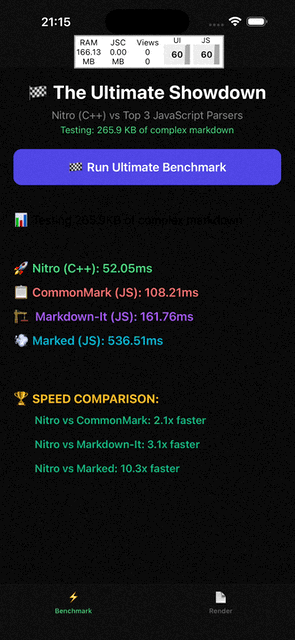

<p align="center">
  
</p>

# react-native-nitro-markdown

Native Markdown parsing and rendering for React Native.

`react-native-nitro-markdown` uses `md4c` (C++) through Nitro Modules (JSI) to parse Markdown synchronously into a typed AST, then render it with customizable React Native components.

## Why use it

- Native parser (`md4c`) for lower JS thread overhead on large documents
- End-to-end solution: parser + renderer + streaming session API
- Headless API for custom rendering and text processing
- GFM support (tables, strikethrough, task lists, autolinks)
- Optional math rendering with `react-native-mathjax-svg`

## Requirements

- React Native `>=0.75.0`
- `react-native-nitro-modules`

Optional for math rendering:

- `react-native-mathjax-svg >=0.9.0`
- `react-native-svg >=13.0.0`

## Installation

### React Native

```bash
bun add react-native-nitro-markdown react-native-nitro-modules
```

Optional math support:

```bash
bun add react-native-mathjax-svg react-native-svg
```

iOS pods:

```bash
cd ios && pod install
```

### Expo (development build)

```bash
bunx expo install react-native-nitro-markdown react-native-nitro-modules
bunx expo prebuild
```

Optional math support:

```bash
bunx expo install react-native-mathjax-svg react-native-svg
```

## Quick Start

```tsx
import { Markdown } from "react-native-nitro-markdown";

export function Example() {
  return (
    <Markdown options={{ gfm: true }}>
      {"# Hello\nThis is **native** markdown."}
    </Markdown>
  );
}
```

## Demo App Tour

The example app in `apps/example` now maps each major feature to a screen:

- `Bench` (`app/index.tsx`)
  - Nitro benchmark + JS parser comparisons
- `Default` (`app/render-default.tsx`)
  - Built-in renderer defaults
- `Styles` (`app/render-default-styles.tsx`)
  - `styles` prop and theme token overrides
- `Custom` (`app/render-custom.tsx`)
  - `renderers` overrides + `astTransform`
- `Stream` (`app/render-stream.tsx`)
  - streaming UX with live token append

## Runtime API Coverage (Demo + Docs)

This table maps each runtime API to where it is demonstrated.

| API | Purpose | Demo usage |
| --- | --- | --- |
| `Markdown` | Parse + render markdown component | `apps/example/app/render-default.tsx` |
| `Markdown` `options` | Enable parser flags (`gfm`, `math`) | `apps/example/app/render-default.tsx` |
| `Markdown` `styles` | Per-node style overrides | `apps/example/app/render-default-styles.tsx` |
| `Markdown` `renderers` | Custom node renderer overrides | `apps/example/app/render-custom.tsx` |
| `Markdown` `astTransform` | Post-parse AST transform hook | `apps/example/app/render-custom.tsx` |
| `Markdown` `virtualize` / `virtualization*` | Large-document block virtualization | README examples |
| `MarkdownStream` | Stream rendering from session text | `apps/example/app/render-stream.tsx` |
| `useMarkdownSession` | Own and reuse a native markdown session | `apps/example/app/render-stream.tsx` |
| `createMarkdownSession` | Create a manual session instance | README examples |
| `useStream` | Timed playback sync + highlighting | README examples |
| `parseMarkdown` | Headless parse/benchmark pipeline | `apps/example/app/index.tsx` |
| `parseMarkdownWithOptions` | Headless parse with parser flags | README examples |
| `getTextContent` | Extract raw text from AST subtree | README examples |
| `getFlattenedText` | Normalize AST text for indexing/search | README examples |
| `MarkdownParserModule` | Low-level Nitro parser access | README examples |
| `mergeThemes` / `defaultMarkdownTheme` / `minimalMarkdownTheme` | Theme composition and style presets | `apps/example/app/render-default-styles.tsx` + README examples |
| `useMarkdownContext` / `MarkdownContext` | Access theme/renderer/link handlers inside custom trees | README examples |
| Built-in renderer components (`CodeBlock`, `TableRenderer`, etc.) | Compose renderer overrides with built-ins | `apps/example/app/render-custom.tsx` |
| `onLinkPress`, `onParsingInProgress`, `onParseComplete`, `plugins`, `sourceAst` | Advanced lifecycle/link/pipeline control | README examples |

## Feature Index

Use this table as a quick map from feature -> API -> demo usage.

| Feature                  | API                                                 | What it does                                              | Demo                                  |
| ------------------------ | --------------------------------------------------- | --------------------------------------------------------- | ------------------------------------- |
| Basic markdown rendering | `Markdown`                                          | Parse and render markdown in one component                | `app/render-default.tsx`              |
| Parser flags             | `options` (`gfm`, `math`)                           | Enable GFM and math parsing                               | `app/render-default.tsx`              |
| Plugin pipeline          | `plugins` (`beforeParse`, `afterParse`)             | Rewrite markdown input or AST around parse                | README examples                       |
| AST transform            | `astTransform`                                      | Post-parse AST rewrite before render                      | `app/render-custom.tsx`               |
| Pre-parsed AST render    | `sourceAst`                                         | Skip parsing during render and render existing AST        | README examples                       |
| Parse lifecycle          | `onParsingInProgress`, `onParseComplete`            | Observe parse start/finish and consume normalized text    | README examples                       |
| Link interception        | `onLinkPress`                                       | Override default URL open behavior                        | README examples                       |
| Large doc virtualization | `virtualize`, `virtualizationMinBlocks`             | Virtualizes top-level blocks for very large markdown docs | README examples                       |
| Streaming markdown       | `MarkdownStream` + `createMarkdownSession`          | Render incrementally appended markdown content            | `app/render-stream.tsx`               |
| Timed highlight sync     | `useStream(timestamps)`                             | Sync highlight position to playback timeline              | README examples                       |
| Headless parsing         | `parseMarkdown`, `parseMarkdownWithOptions`         | Parse markdown without built-in UI                        | `app/index.tsx` + README examples     |
| Custom node rendering    | `renderers` + built-in renderer components          | Replace specific node UI while preserving parser behavior | `app/render-custom.tsx`               |
| Styling and theme        | `theme`, `styles`, `stylingStrategy`, `mergeThemes` | Control visual tokens and per-node styles                 | `app/render-default-styles.tsx`       |
| Low-level parser access  | `MarkdownParserModule`                              | Direct access to Nitro parser methods                     | README examples                       |

## Package Exports

### Main Entry (`react-native-nitro-markdown`)

- Parser and headless helpers:
  - `parseMarkdown`
  - `parseMarkdownWithOptions`
  - `getTextContent`
  - `getFlattenedText`
  - `MarkdownParserModule`
- Components:
  - `Markdown`
  - `MarkdownStream`
- Hooks and sessions:
  - `useMarkdownSession`
  - `useStream`
  - `createMarkdownSession`
- Context:
  - `MarkdownContext`
  - `useMarkdownContext`
- Theme:
  - `defaultMarkdownTheme`
  - `minimalMarkdownTheme`
  - `mergeThemes`
- Built-in renderers:
  - `Heading`, `Paragraph`, `Link`, `Blockquote`, `HorizontalRule`
  - `CodeBlock`, `InlineCode`
  - `List`, `ListItem`, `TaskListItem`
  - `TableRenderer`, `Image`, `MathInline`, `MathBlock`
- Types:
  - `MarkdownNode`, `ParserOptions`, `MarkdownParser`
  - `MarkdownProps`, `AstTransform`, `MarkdownPlugin`, `MarkdownStreamProps`, `MarkdownVirtualizationOptions`
  - `CustomRenderers`, `CustomRenderer`, `CustomRendererProps`
  - `NodeRendererProps`, `BaseCustomRendererProps`, `EnhancedRendererProps`
  - `HeadingRendererProps`, `LinkRendererProps`, `ImageRendererProps`
  - `CodeBlockRendererProps`, `InlineCodeRendererProps`
  - `ListRendererProps`, `TaskListItemRendererProps`
  - `LinkPressHandler`, `MarkdownContextValue`
  - `MarkdownTheme`, `PartialMarkdownTheme`, `NodeStyleOverrides`, `StylingStrategy`
  - `MarkdownSession`

### Headless Entry (`react-native-nitro-markdown/headless`)

Exports only parser-related API (`parseMarkdown`, `parseMarkdownWithOptions`, `extractPlainText`, `extractPlainTextWithOptions`, `getTextContent`, `getFlattenedText`, types). Use this when you do not need built-in UI rendering.

## Component API

## `Markdown`

```tsx
import { Markdown } from "react-native-nitro-markdown";
```

Demo usage:

- `apps/example/app/render-default.tsx`
- `apps/example/app/render-default-styles.tsx`
- `apps/example/app/render-custom.tsx`

| Prop                  | Type                         | Default                                          | Description                                                                               |
| --------------------- | ---------------------------- | ------------------------------------------------ | ----------------------------------------------------------------------------------------- |
| `children`            | `string`                     | required                                         | Markdown input string.                                                                    |
| `options`             | `ParserOptions`              | `undefined`                                      | Parser flags (`gfm`, `math`).                                                             |
| `plugins`             | `MarkdownPlugin[]`           | `undefined`                                      | Optional parser plugin hooks (`beforeParse`, `afterParse`).                               |
| `sourceAst`           | `MarkdownNode`               | `undefined`                                      | Pre-parsed AST. When provided, native parse is skipped.                                   |
| `astTransform`        | `AstTransform`               | `undefined`                                      | Transform hook applied after plugins, before rendering and `onParseComplete`.             |
| `renderers`           | `CustomRenderers`            | `{}`                                             | Per-node custom renderers.                                                                |
| `theme`               | `PartialMarkdownTheme`       | `defaultMarkdownTheme` or `minimalMarkdownTheme` | Theme token overrides.                                                                    |
| `styles`              | `NodeStyleOverrides`         | `undefined`                                      | Per-node style overrides.                                                                 |
| `stylingStrategy`     | `"opinionated" \| "minimal"` | `"opinionated"`                                  | Base styling preset.                                                                      |
| `style`               | `StyleProp<ViewStyle>`       | `undefined`                                      | Container style for the root `View`.                                                      |
| `onParsingInProgress` | `() => void`                 | `undefined`                                      | Called when parse inputs change.                                                          |
| `onParseComplete`     | `(result) => void`           | `undefined`                                      | Called with `{ raw, ast, text }` after successful parse.                                  |
| `onLinkPress`         | `LinkPressHandler`           | `undefined`                                      | Intercepts link press before default open behavior. Return `false` to block default open. |
| `virtualize`          | `boolean \| "auto"`          | `false`                                          | Enables top-level block virtualization. Use `"auto"` to activate by block threshold.       |
| `virtualizationMinBlocks` | `number`                 | `40`                                             | Minimum top-level block count before virtualization activates.                             |
| `virtualization`      | `MarkdownVirtualizationOptions` | `undefined`                                   | Optional FlatList tuning (`windowSize`, `initialNumToRender`, batching, clipping).        |

Notes:

- Parse failures are caught and rendered as a fallback message (`Error parsing markdown`).
- `text` in `onParseComplete` is produced by `getFlattenedText(ast)`.
- `astTransform` should be wrapped with `useCallback` to avoid unnecessary re-parses.
- `astTransform` is a post-parse AST rewrite hook. It does not add parser syntax support and is not a markdown-it plugin API.
- Plugin pipeline order is: `beforeParse` -> parse/sourceAst -> `afterParse` -> `astTransform` -> render.
- Tables render immediately with estimated column widths, then refine widths after layout measurement to improve reliability on slower layout cycles.
- For very large markdown content, enable `virtualize` to avoid mounting all top-level blocks at once.
- `virtualize="auto"` enables threshold-driven virtualization while keeping small markdown renders on plain `View` trees.

### Virtualization example (large docs)

```tsx
<Markdown
  virtualize="auto"
  virtualizationMinBlocks={30}
  virtualization={{
    initialNumToRender: 10,
    maxToRenderPerBatch: 10,
    windowSize: 8,
    updateCellsBatchingPeriod: 16,
    removeClippedSubviews: true,
  }}
>
  {content}
</Markdown>
```

Virtualization notes:

- Keep `Markdown` as the primary vertical scroller when `virtualize` is enabled.
- Avoid nesting it inside another vertical `ScrollView`, or virtualization effectiveness drops.

### AST transform example

```tsx
import { useCallback } from "react";
import { Markdown, type AstTransform } from "react-native-nitro-markdown";

const astTransform = useCallback<AstTransform>((ast) => {
  const transformNode = (node: Parameters<AstTransform>[0]) => ({
    ...node,
    content:
      node.type === "text"
        ? (node.content ?? "").replace(/:wink:/g, "😉")
        : node.content,
    children: node.children?.map(transformNode),
  });

  return transformNode(ast);
}, []);

<Markdown astTransform={astTransform}>{"Hello :wink:"}</Markdown>;
```

### Plugin pipeline example (`beforeParse` + `afterParse`)

```tsx
import { Markdown, type MarkdownPlugin } from "react-native-nitro-markdown";

const plugins: MarkdownPlugin[] = [
  {
    name: "rewrite-before-parse",
    beforeParse: (input) => input.replace(/:rocket:/g, "ROCKET_TOKEN"),
  },
  {
    name: "rewrite-after-parse",
    afterParse: (ast) => {
      const visit = (node: typeof ast): typeof ast => ({
        ...node,
        content:
          node.type === "text"
            ? (node.content ?? "").replace(/ROCKET_TOKEN/g, "🚀")
            : node.content,
        children: node.children?.map(visit),
      });
      return visit(ast);
    },
  },
];

<Markdown plugins={plugins}>{"Launch :rocket:"}</Markdown>;
```

### `sourceAst` example (skip parsing in render)

```tsx
import {
  Markdown,
  parseMarkdownWithOptions,
} from "react-native-nitro-markdown";

const sourceAst = parseMarkdownWithOptions(content, { gfm: true, math: true });

<Markdown sourceAst={sourceAst}>
  {"children is ignored when sourceAst is provided"}
</Markdown>;
```

### Parse lifecycle callbacks example

```tsx
import { Markdown } from "react-native-nitro-markdown";

<Markdown
  onParsingInProgress={() => setIsParsing(true)}
  onParseComplete={({ raw, ast, text }) => {
    setIsParsing(false);
    setWordCount(text.trim().split(/\s+/).length);
    setLastRaw(raw);
    setLastAst(ast);
  }}
>
  {content}
</Markdown>;
```

## `MarkdownStream`

```tsx
import { MarkdownStream } from "react-native-nitro-markdown";
```

`MarkdownStreamProps` extends `MarkdownProps` except `children`.

Demo usage:

- `apps/example/app/render-stream.tsx`

| Prop                   | Type                  | Default      | Description                                                                              |
| ---------------------- | --------------------- | ------------ | ---------------------------------------------------------------------------------------- |
| `session`              | `MarkdownSession`     | required     | Session object that supplies streamed text chunks.                                       |
| `updateIntervalMs`     | `number`              | `50`         | Flush interval when `updateStrategy="interval"`.                                         |
| `updateStrategy`       | `"interval" \| "raf"` | `"interval"` | Update cadence (`setTimeout` vs `requestAnimationFrame`).                                |
| `useTransitionUpdates` | `boolean`             | `false`      | Applies `startTransition` to streamed UI updates.                                        |
| `incrementalParsing`   | `boolean`             | `true`       | Enables append-optimized incremental AST updates (falls back to full parse when unsafe). |

Notes:

- If any plugin defines `beforeParse`, `MarkdownStream` disables incremental AST mode for correctness.
- `MarkdownStream` consumes native session change ranges (`from`, `to`) and uses `getTextRange()` for contiguous appends to avoid full-buffer copies during token streams.

### Streaming Example

```tsx
import { useEffect } from "react";
import {
  MarkdownStream,
  useMarkdownSession,
} from "react-native-nitro-markdown";

export function StreamingExample() {
  const session = useMarkdownSession();

  useEffect(() => {
    const s = session.getSession();
    s.append("# Streaming\n");
    s.append("This text arrives in chunks.");

    return () => session.clear();
  }, [session]);

  return (
    <MarkdownStream
      session={session.getSession()}
      options={{ gfm: true }}
      updateStrategy="raf"
      useTransitionUpdates
    />
  );
}
```

## Hooks and Session API

## `createMarkdownSession()`

Creates and returns a native `MarkdownSession` instance.

```tsx
import { createMarkdownSession } from "react-native-nitro-markdown";

const session = createMarkdownSession();
session.append("hello");
```

`MarkdownSession` methods:

| Method | Signature | Description |
| --- | --- | --- |
| `append` | `(chunk: string) => number` | Appends text and returns new UTF-16 length. |
| `clear` | `() => void` | Clears buffer and emits a reset range event (`0, 0`). |
| `getAllText` | `() => string` | Returns full session text. |
| `getLength` | `() => number` | Returns current UTF-16 text length without materializing a copy. |
| `getTextRange` | `(from: number, to: number) => string` | Returns a substring range for delta-driven streaming updates. |
| `addListener` | `(listener: (from: number, to: number) => void) => () => void` | Subscribes to mutation range events and returns an unsubscribe function. |
| `highlightPosition` | `number` | Mutable cursor used by stream highlight workflows. |

Demo usage:

- Referenced in `apps/example/app/render-stream.tsx` sample markdown content and used directly in README examples.

Manual session + stream rendering:

```tsx
import {
  createMarkdownSession,
  MarkdownStream,
} from "react-native-nitro-markdown";

const session = createMarkdownSession();
session.append("# Hello\n");
session.append("Streaming content...");

<MarkdownStream session={session} updateStrategy="raf" />;
```

## `useMarkdownSession()`

Creates and owns one `MarkdownSession` for a component lifecycle.

Returns:

| Field            | Type                         | Description                                                   |
| ---------------- | ---------------------------- | ------------------------------------------------------------- |
| `getSession`     | `() => MarkdownSession`      | Returns the stable native session instance.                   |
| `isStreaming`    | `boolean`                    | Stateful flag for app-level streaming UI.                     |
| `setIsStreaming` | `(value: boolean) => void`   | Setter for `isStreaming`.                                     |
| `stop`           | `() => void`                 | Sets `isStreaming` to `false`.                                |
| `clear`          | `() => void`                 | Clears session content and resets `highlightPosition` to `0`. |
| `setHighlight`   | `(position: number) => void` | Sets `session.highlightPosition`.                             |

Demo usage:

- `apps/example/app/render-stream.tsx`

## `useStream(timestamps?)`

Builds on `useMarkdownSession` and adds timeline sync helpers.

- `timestamps` type: `Record<number, number>` where key = word/token index, value = timestamp in ms.
- `sync(currentTimeMs)` computes highlight position from timestamp map.
- Uses optimized lookup for monotonic timelines and handles non-monotonic maps safely.

Additional returned fields:

| Field          | Type                              | Description                               |
| -------------- | --------------------------------- | ----------------------------------------- |
| `isPlaying`    | `boolean`                         | Playback state for timed streaming.       |
| `setIsPlaying` | `(value: boolean) => void`        | Setter for `isPlaying`.                   |
| `sync`         | `(currentTimeMs: number) => void` | Applies timeline-based highlight updates. |

Example:

```tsx
const stream = useStream({
  0: 0,
  1: 500,
  2: 1000,
});

// e.g. in media time update callback:
stream.sync(currentTimeMs);

<MarkdownStream session={stream.getSession()} />;
```

Demo usage:

- README examples (timed playback scenario)

## Headless API

```tsx
import {
  parseMarkdown,
  parseMarkdownWithOptions,
  extractPlainText,
  extractPlainTextWithOptions,
  getTextContent,
  getFlattenedText,
} from "react-native-nitro-markdown/headless";
```

| Function                   | Signature                                                | Description                                                        |
| -------------------------- | -------------------------------------------------------- | ------------------------------------------------------------------ |
| `parseMarkdown`            | `(text: string) => MarkdownNode`                         | Parses markdown using default parser settings.                     |
| `parseMarkdownWithOptions` | `(text: string, options: ParserOptions) => MarkdownNode` | Parses markdown with `gfm` and/or `math` flags.                    |
| `extractPlainText`         | `(text: string) => string`                               | Parses and returns normalized plain text directly from native parser. |
| `extractPlainTextWithOptions` | `(text: string, options: ParserOptions) => string`   | Same as above with parser flags.                                   |
| `getTextContent`           | `(node: MarkdownNode) => string`                         | Concatenates text recursively without layout normalization.        |
| `getFlattenedText`         | `(node: MarkdownNode) => string`                         | Returns normalized plain text with paragraph and block separators. |

### Parser Options

```ts
type ParserOptions = {
  gfm?: boolean;
  math?: boolean;
};
```

Example:

```tsx
const ast = parseMarkdownWithOptions(markdown, {
  gfm: true, // tables, task lists, strikethrough
  math: true, // inline/block LaTeX
});
```

### `MarkdownParserModule` (low-level Nitro access)

Use this only when you want direct method access (`parse`, `parseWithOptions`, `extractPlainText`, `extractPlainTextWithOptions`).

```tsx
import {
  MarkdownParserModule,
  type ParserOptions,
} from "react-native-nitro-markdown/headless";

const options: ParserOptions = { gfm: true };
const jsonAst = JSON.parse(
  MarkdownParserModule.parseWithOptions("# Hello", options),
);
```

## Custom Renderer API

## `renderers` prop contract

`CustomRenderers` is:

```ts
type CustomRenderers = Partial<Record<MarkdownNode["type"], CustomRenderer>>;
```

`CustomRenderer` receives `EnhancedRendererProps` and returns:

- React node to override default rendering
- `undefined` to fallback to built-in renderer
- `null` to render nothing

`EnhancedRendererProps` always includes:

- `node`: current `MarkdownNode`
- `children`: pre-rendered node children
- `Renderer`: recursive renderer component for nested custom rendering

And conditionally includes mapped fields by node type:

| Node type        | Extra mapped fields   |
| ---------------- | --------------------- |
| `heading`        | `level`               |
| `link`           | `href`, `title`       |
| `image`          | `url`, `alt`, `title` |
| `code_block`     | `content`, `language` |
| `code_inline`    | `content`             |
| `list`           | `ordered`, `start`    |
| `task_list_item` | `checked`             |

### Example: Custom heading + code block

```tsx
import {
  Markdown,
  type HeadingRendererProps,
  type CodeBlockRendererProps,
} from "react-native-nitro-markdown";

const renderers = {
  heading: ({ level, children }: HeadingRendererProps) => (
    <MyHeading level={level}>{children}</MyHeading>
  ),
  code_block: ({ language, content }: CodeBlockRendererProps) => (
    <MyCode language={language} content={content} />
  ),
};

<Markdown renderers={renderers}>{content}</Markdown>;
```

### `useMarkdownContext` example (inside custom renderer tree)

```tsx
import { Text } from "react-native";
import {
  Markdown,
  useMarkdownContext,
  type CustomRendererProps,
} from "react-native-nitro-markdown";

function ThemedParagraph({ children }: Pick<CustomRendererProps, "children">) {
  const { theme } = useMarkdownContext();
  return <Text style={{ color: theme.colors.text }}>{children}</Text>;
}

<Markdown
  renderers={{
    paragraph: ({ children }: CustomRendererProps) => (
      <ThemedParagraph>{children}</ThemedParagraph>
    ),
  }}
>
  {content}
</Markdown>;
```

## Link Handling Behavior

Default link renderer behavior:

1. Trims incoming href.
2. Calls `onLinkPress(href)` if provided.
3. Stops if handler returns `false`.
4. Allows only protocol-based links with these schemes:
   - `http:`
   - `https:`
   - `mailto:`
   - `tel:`
   - `sms:`
5. Uses `Linking.canOpenURL` before `Linking.openURL`.

Relative URLs and anchors are ignored by default open behavior, but you can handle them in `onLinkPress`.

## Theme API

## `MarkdownTheme`

```tsx
import type {
  MarkdownTheme,
  PartialMarkdownTheme,
} from "react-native-nitro-markdown";
```

`MarkdownTheme` fields:

- `colors`
  - `text`, `textMuted`, `heading`, `link`, `code`, `codeBackground`, `codeLanguage`
  - `blockquote`, `border`, `surface`, `surfaceLight`, `accent`
  - `tableBorder`, `tableHeader`, `tableHeaderText`, `tableRowEven`, `tableRowOdd`
- `spacing`: `xs`, `s`, `m`, `l`, `xl`
- `fontSizes`: `xs`, `s`, `m`, `l`, `xl`, `h1`, `h2`, `h3`, `h4`, `h5`, `h6`
- `fontFamilies`: `regular`, `heading`, `mono`
- `headingWeight?`
- `borderRadius`: `s`, `m`, `l`
- `showCodeLanguage`

Helpers:

- `defaultMarkdownTheme`
- `minimalMarkdownTheme`
- `mergeThemes(base, partial)`

`NodeStyleOverrides` lets you override per-node styles:

```ts
type NodeStyleOverrides = Partial<
  Record<MarkdownNode["type"], ViewStyle | TextStyle>
>;
```

Example with `mergeThemes`:

```tsx
import {
  Markdown,
  defaultMarkdownTheme,
  mergeThemes,
} from "react-native-nitro-markdown";

const theme = mergeThemes(defaultMarkdownTheme, {
  colors: {
    text: "#0f172a",
    link: "#1d4ed8",
  },
  fontSizes: {
    m: 16,
  },
});

<Markdown theme={theme}>{content}</Markdown>;
```

## Built-in Renderer Components

Use these when composing custom renderer maps.

| Component        | Key props                                        |
| ---------------- | ------------------------------------------------ |
| `Heading`        | `level`, `children`, `style`                     |
| `Paragraph`      | `children`, `inListItem`, `style`                |
| `Link`           | `href`, `children`, `style`                      |
| `Blockquote`     | `children`, `style`                              |
| `HorizontalRule` | `style`                                          |
| `CodeBlock`      | `language`, `content`, `node`, `style`           |
| `InlineCode`     | `content`, `node`, `children`, `style`           |
| `List`           | `ordered`, `start`, `depth`, `children`, `style` |
| `ListItem`       | `children`, `index`, `ordered`, `start`, `style` |
| `TaskListItem`   | `children`, `checked`, `style`                   |
| `TableRenderer`  | `node`, `Renderer`, `style`                      |
| `Image`          | `url`, `title`, `alt`, `Renderer`, `style`       |
| `MathInline`     | `content`, `style`                               |
| `MathBlock`      | `content`, `style`                               |

## Supported AST Node Types

`document`, `heading`, `paragraph`, `text`, `bold`, `italic`, `strikethrough`, `link`, `image`, `code_inline`, `code_block`, `blockquote`, `horizontal_rule`, `line_break`, `soft_break`, `table`, `table_head`, `table_body`, `table_row`, `table_cell`, `list`, `list_item`, `task_list_item`, `math_inline`, `math_block`, `html_block`, `html_inline`

Notes:

- `html_inline` and `html_block` are parsed but not rendered by default.
- Table internals (`table_head`, `table_body`, `table_row`, `table_cell`) are renderer internals; override `table` for custom table UI.

## Recipes

### Intercept links with `onLinkPress`

```tsx
import { Markdown } from "react-native-nitro-markdown";

<Markdown
  onLinkPress={(href) => {
    if (href.startsWith("/")) {
      router.push(href);
      return false;
    }
  }}
>
  {content}
</Markdown>;
```

### Use headless mode to build search index

```tsx
import {
  parseMarkdown,
  getFlattenedText,
} from "react-native-nitro-markdown/headless";

const ast = parseMarkdown(content);
const searchableText = getFlattenedText(ast);
```

### Minimal styling baseline

```tsx
import { Markdown } from "react-native-nitro-markdown";

<Markdown
  stylingStrategy="minimal"
  theme={{
    colors: {
      text: "#0f172a",
      link: "#1d4ed8",
    },
  }}
>
  {content}
</Markdown>;
```

## Performance Guidance

- For streaming text, prefer `updateStrategy="raf"`.
- If you use interval strategy, `updateIntervalMs` between `50` and `100` is a good baseline.
- Batch `session.append(...)` calls instead of appending one character at a time.
- For large markdown documents, enable `virtualize` and tune `virtualization.windowSize` / `maxToRenderPerBatch`.
- Use the headless API if you do not need built-in renderers.

## Troubleshooting

- Math appears as plain code-style fallback:
  - Install `react-native-mathjax-svg` and `react-native-svg`.
- iOS native build issues after install:
  - Run `pod install` in your iOS project.
- Expo app does not load native module:
  - Use a development build (`expo prebuild` + `expo run`), not Expo Go.
- Android heading font weight looks wrong:
  - Set `theme.headingWeight` explicitly (for custom fonts without bold variants, use `"normal"`).

## Contributing

See `CONTRIBUTING.md`.

## License

MIT
